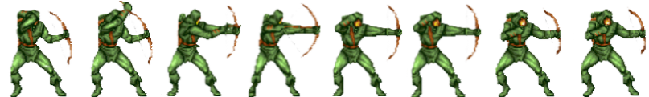
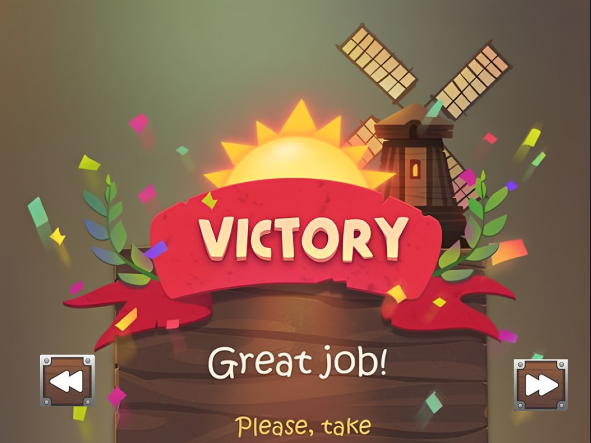

[[English]](README_en.md)

# Bắn quái

- Thử nghiệm game: [https://youtu.be/EyTwTOWr5zU](https://youtu.be/EziCb7U9UbU)
- Phá đảo game: https://youtu.be/0RQHeCaz4sg

# Giới thiệu game

Bắn quái là tựa game phiêu lưu , mạo hiểm , gây cảm giác thích thú cho người chơi , hứng phấn cho người . Có tác dụng giải trí cao , xua tan căng thẳng , mệt mỏi sau những giờ làm việc căng thẳng.

- [0. Cách tải game](#0-cách-tải-game)
    * [a. Cách 1: Không bao gồm code.](#a-cách-1-không-bao-gồm-code)
    * [b. Cách 2: Bao gồm code và có thể biên dịch.](#b-cách-2-bao-gồm-code-và-có-thể-biên-dịch)
- [1. Bắt đầu game](#1bắt-đầu-game)
- [2. level game](#2chọn-level)
- [3. Các thành phần trong game:](#3-các-thành-phần-trong-game)
- [4. Cách chơi](#4-cách-chơi)
    * [a. Các loại cây](#acác-loại-cây)
    * [b. Các loại zombie](#bcác-loại-zombie)
- [5. Chiến thắng và thất bại](#5-chiến-thắng-và-thất-bại)
- [Về đồ họa của game:](#về-đồ-họa-của-game)
- [Về source code game](#về-source-code-game)

# 0. Cách tải game

## a. Cách 1: Không bao gồm code.

Tải game (được nén thành .zip) tại link
sau: https://github.com/Dunguser/NGUYENDUNG_GAMEBANQUAI.git 
Cách này tiết kiệm bộ nhớ và thời gian tải đi rất nhiều (khoảng 103MB). 
Giải nén game vào một thư mục và bật pvz.exe lên và chơi. 

## b. Cách 2: Bao gồm code và có thể biên dịch.

**Bước 1:** Clone repo này về (Khoảng 800 MB - do có cả lịch sử các phiên bản).  
Hoặc Chọn Code -> Download Zip (Khoảng 90MB)

- Tất cả code đều nằm trong thư mục src. 
- Có thể nhảy đến bước 5 để chơi luôn.

**Bước 2:** Cài mingw. Ở đây tôi cài đặt phiên bản MinGW-W64
GCC-8.1.0 [x86_64-posix-seh](https://sourceforge.net/projects/mingw-w64/files/Toolchains%20targetting%20Win64/Personal%20Builds/mingw-builds/8.1.0/threads-posix/seh/x86_64-8.1.0-release-posix-seh-rt_v6-rev0.7z/download). 
Một số chú ý:  

- Nếu sử dụng trình biên dịch khác thì phải dịch lại icon: vào thư mục icon rồi dùng
  lệnh `windres main.rc -O coff main.res` trong cmd. 
- Phải xóa ba dll của c++ trong thư mục chứa pvz.exe: `libgcc_s_seh-1.dll`, `libstdc++-6.dll`, `libwinpthread-1.dll`. Ba
  dll này chỉ dành cho người chơi không cài sẵn c++ trong máy.

**Bước 3:** Cài GNU make

**Bước 4:** Mở cmd trong thư mục chứa Makefile và gõ lệnh make.

**Bước 5:** Bật pvz.exe và chơi

# 1. Bắt đầu game

*Chờ bức ảnh ban đầu một lúc

*Chờ một chút rồi click vào nút “CLICK TO PLAY!” để bắt đầu chơi game.Hoặc "CLICK TO EXIT" để thoát game.

# 2.  level game 

*Có tổng cộng 3 level với mức độ khó dễ khác nhau để bạn chơi. Bạn sẽ chơi lần lượt từng level 1. Tùy lối đánh của từng người mà độ khó dễ sẽ khác nhau. Ví dụ bạn là bậc thầy trong game đối kháng 2 người thì màn 2 sẽ vô cùng đơn giản như bạn. Hoặc bạn thích kiểu bắn quái, phiêu lưu mạo hiểm , thích khám phá map thì màn 1 và màn 3 sẽ phù hợp với bạn.

 -màn 1 : các hình ảnh 

-màn 2 : các hình ảnh

-màn 3 : các hình ảnh

<!-- Khi vào game, có 2 loại level mà mọi người sẽ gặp: buổi sáng (bên trái) và buổi tối (bên phải)

- Buổi sáng thì thi thoảng sẽ có sun (mặt trời) từ trên trời rơi xuống.
- Còn buổi tối thì không có, vậy nên game sẽ khó hơn một chút.

Trước khi bắt đầu game, bạn sẽ được biết trước có những loại zombie gì sẽ xuất hiện.

 -->

# 3. Các thành phần trong game:

-    Kim cương đỏ ( giúp tăng số mạng ) 
     : là thứ giúp ta tăng thêm một mạng sau mỗi làn ăn

-   Kim cương xanh (giúp nhân vật có thể bay)
     : giúp nhân vật có thể bay lên trong số lần nhất định và trang bị cho nhân vật đạn đỏ.
-   Đạn đỏ ( giúp bắn từ trên cao xuống)

- đạn thường ( loại đạn nhân vật chính dùng để bắn ) : 
 

<!-- 

 -->

- kiếm ( vật có sức sát thương mạnh nhất trong game , nó sẽ quay vòng tròn xung quanh nhân vật, tạo sức sát thương cho bất cứ thứ gì gần nó) 

- trái tym ()

    tượng trưng cho số mạng của nhân vật chính

- thanh máu nhân vật chính

- thanh máu quỉ 

- nút dừng game :

- ảnh tạm dừng:

- công cụ bay : 

- phụng hoàng : tạo ra kiếm cho nhân vật chính:  

# 4. Cách chơi

- Sử dụng các phím lên , trái , phải để di chuyển nhân vật. 
- Sử dụng các phím w, a, d tương ứng với lên trên , sang trái, sang phải và thêm trạng thái nhào lộn của nhân vật chính. 
- Sử dụng phím z ,c để kích hoạt trạng thái bay trái và phải
- Sử dụng phím x để kích hoạt kiếm.
- Ăn thật nhiều tiền để thoát nghèo.
- Ăn thật nhiều đồ hỗ trợ để tăng sức mạnh, tăng mạng.
- dùng nút trái chuột để bắn đạn, hoặc nút phải chuột để bắn đạn khi bay.
- 

## a. Các loại đồ hỗ trợ

|                                                                             | Tên đồ hỗ trợ	     | Chức năng                                                                                                                    |
|-----------------------------------------------------------------------------|--------------|------------------------------------------------------------------------------------------------------------------------------|
|   | kim cương đỏ	  | mỗi lần ăn tăng 1 mạng                                                                                              |
|     | kim cương xanh	   | giúp nhân vật có thể bay được                                                                               |
|           | phượng hoàng	    | giúp nhân vật có kiếm                                                   |
|         | tiền	    | chống nghèo, giúp nhân vật chính mau giàu

## b. Các loại quái

- Có 2 loại quái:

|                                         | Tên zombie 	       | Chức năng                                                                                        |
|-----------------------------------------|--------------------|--------------------------------------------------------------------------------------------------|
|  | chằn tinh	  | quái bình thường                  |
|    | boss 	       | Boss chính của trận đấu                           |

# 5. Chiến thắng và thất bại

- Bạn sẽ chiến thắng nếu tiêu diệt hết tất cả zombie trong ván đó.

    * ăn mừng thật ngạo nghễ nào!!!

    * xin được chúc mừng bạn
  

  

- Bạn sẽ thất bại nếu có một zombie nào đó đi hết sân để vào nhà bạn.
    * thật buồn khi bạn không thể chiến thắng

    * tổng hợp những gì bạn đã làm được nào
    

    * bạn có muốn chơi lại không
     

---

### Về đồ họa của game:

- sự dụng từng ô tile map một

### Về source code game:

- Folder IMG:
    * chứa  các ảnh trong game 
- Folder MAP: 
    * chứa các ảnh để xây dựng map
- các file:
    * all_anh_nvc : tải tất cả ảnh nhân vật chính
    * all_anh_qui : tải tất cả các ảnh quỉ
    *BaseObject : lớp cơ sở cho các lớp khác
    * BulletObject : lớp đạn dùng cho cả nhân vật chính và quỉ
    * commonfunction : lưu 1 số struct và 1 số biến toàn cục, các hàm check vị trí chuột và va chạm
    * CHECK_VA_CHAM : check va chạm đạn, kiếm giữa các nhân vật với nhau
    * games_function : khỏi tạo các hàm như Init() , LoadMedia() , close();
    * GAMEMAP: xây dựng bản đồ cho nhân vật và trò chơi
    * HandleEvent : xủ lí sự kiện bàn phím và chuôt.trong vòng lặp while(!quit);
    * Ho_tro(): các chỉ số trong game như số tiền ăn được, số quái đã bị giết, thời gian đã chơi,..
    * MainObject : nhân vật chính
    * QUIVUONG : xây dựng boss chính
    * ThreatsObject : xây dựng đội quân quỉ
    * vuno : khỏi tạo hiệu ứng nổ khí đạn và kiếm va chạm với người
    * win_or_lose : xử lí sau khí thắng 1 màn hoặc thua 1 màn 
